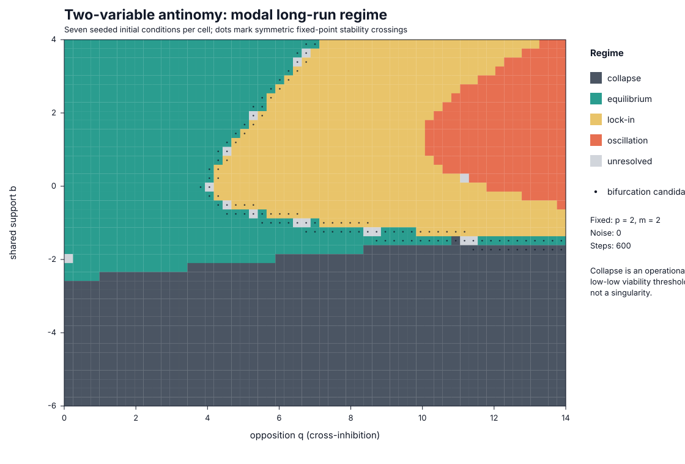

# Minimal two-variable antinomy model

## Purpose and status

This exploratory model asks a narrow question: can one symmetric, bounded,
two-variable response map distinguish several meanings that the project has
placed under the word *balance*? It is a mechanism demonstration, not an
empirical model of a federation or evidence that any historical opposition is
an antinomy.

The answer is provisionally yes for stable equilibrium, asymmetric lock-in,
and period-two oscillation. The map also produces stable low-low states that
fail a declared viability threshold. Those states are called **collapse** only
in that operational sense. Bifurcation is not treated as a fifth trajectory
type: the visual map marks parameter cells where the symmetric fixed point
changes linear stability, making them candidates for local bifurcation.



## Variables, parameters, and update rule

The two state variables are dimensionless capacities bounded between zero and
one:

- `A[t]`, **local autonomy capacity**: the ability of local units to initiate,
  vary, or refuse action at response interval `t`;
- `C[t]`, **collective coordination capacity**: the ability of the same
  relation to align action, pool information, or maintain common commitments.

They are capacities of one stipulated relation, not amounts of liberty and
authority in society at large. A response interval has no fixed historical
duration.

The deterministic sweep uses

```text
A[t+1] = sigmoid(b + p A[t] + (m - q) C[t])
C[t+1] = sigmoid(b + p C[t] + (m - q) A[t])
sigmoid(z) = 1 / (1 + exp(-z))
```

| Symbol | Meaning | Swept value |
| --- | --- | --- |
| `b` | Shared exogenous support: resources, legitimacy, or infrastructure available to both capacities | -6 to 4 in increments of 0.25 |
| `p` | Persistence or self-reproduction of each capacity | Fixed at 2 |
| `m` | Reciprocal enablement: each capacity makes the other easier to reproduce | Fixed at 2 |
| `q` | Reciprocal opposition: each capacity inhibits the other | 0 to 14 in increments of 0.25 |
| `noise` | Standard deviation of optional independent Gaussian shocks to the response logits | Fixed at 0 in the map |

The one-step synchronous update is the model's response lag. The sigmoid
supplies saturation and keeps both variables bounded. The code accepts seeded
noise, but the published sweep is deterministic; its seven seeds select small
initial perturbations around `(0.5, 0.5)`.

The decomposition of the cross-effect into `m` and `q` makes the intended
mechanisms explicit, but only their difference is identifiable from this map.
No inference about enablement and inhibition as separate empirical effects is
therefore possible.

## Operational regimes

Classification uses the final 100 states of a 600-step trajectory. The exact
thresholds are recorded in [`outputs/summary.json`](outputs/summary.json).

| Label | Operational test | Interpretation and limit |
| --- | --- | --- |
| Equilibrium | Successive changes are at most `1e-7`; both values are not below the collapse threshold; their gap is below 0.25 | A reproduced fixed balance, not harmony or optimality |
| Oscillation | States repeat after two steps within `1e-7`, but not after one; amplitude is at least 0.05 | A period-two response cycle caused by lag and sufficiently strong cross-inhibition; longer or chaotic cycles are not claimed |
| Lock-in | A fixed state with `abs(A - C) >= 0.25` | One capacity remains high and the other low; symmetry gives mirror attractors selected by initial perturbations |
| Collapse | A fixed state with both means below 0.1 | Failure of a declared joint viability condition; not extinction, a singularity, or proof of institutional collapse |
| Unresolved | None of the above | Slow convergence, a boundary case, or dynamics outside the prespecified classes |
| Bifurcation candidate | A parameter cell borders a change in linear stability of the symmetric fixed point | A candidate parameter boundary, not a long-run regime and not a completed normal-form analysis |

At a symmetric fixed point `A = C = s`, the Jacobian eigenvalues are

```text
lambda_symmetric     = s(1 - s) (p + m - q)
lambda_antisymmetric = s(1 - s) (p - m + q)
```

The fixed point is locally stable when both eigenvalues have absolute value
below one. The parameter CSV records the fixed point, both eigenvalues, and the
stability result for every cell. Dots on the map show grid cells adjacent to a
stability change. Continuation on a finer grid would be required to locate and
name the local bifurcations rigorously.

## Results

The sweep contains 2,337 parameter cells and seven seeded initial conditions
per cell. Modal classifications are:

| Regime | Cells |
| --- | ---: |
| Collapse | 951 |
| Equilibrium | 621 |
| Lock-in | 544 |
| Oscillation | 206 |
| Unresolved | 15 |

There are 73 cells where seeds do not agree and 115 cells adjacent to a change
in the symmetric fixed point's linear stability. Seed disagreement is retained
in the CSV rather than resolved by a preferred initial condition. It indicates
multistability or slow boundary behaviour in this deterministic model.

The representative parameter choices retain their expected classifications
over seven seeds and horizons of 300, 600, and 1,200 steps. The collapse example
also retains its label at viability thresholds of 0.075, 0.1, and 0.125. These
are checks on selected examples, not global robustness claims. All 133 recorded
checks pass.

An uncoupled ablation sets `q = m`, so the net cross-effect is zero. Across four
sampled support levels and seven seeds it produces only collapse or equilibrium,
not asymmetric lock-in or coupled oscillation. This establishes that cross-
coupling is necessary for those outcomes in the sampled version of this map; it
does not show that the social mechanisms represented by the coupling exist.

## Reproduction

The implementation and generator use only the Python standard library.

```bash
python3 -m models.antinomy.generate
python3 -m unittest tests.test_antinomy_model -v
```

Generation rewrites these deterministic artifacts:

- [`outputs/parameter_sweep.csv`](outputs/parameter_sweep.csv): cell-level
  parameters, modal classifications, seed counts, fixed points, eigenvalues,
  and boundary flags;
- [`outputs/parameter_map.svg`](outputs/parameter_map.svg): dependency-free
  visual parameter map;
- [`outputs/representative_trajectories.csv`](outputs/representative_trajectories.csv):
  complete trajectories for the four named examples;
- [`outputs/robustness_checks.csv`](outputs/robustness_checks.csv): horizon,
  seed, threshold, and ablation checks;
- [`outputs/summary.json`](outputs/summary.json): exact sweep settings and
  aggregate counts.

## Assumptions and failure conditions

The model assumes symmetry: both capacities have the same persistence,
enablement, inhibition, support, saturation, observation quality, and response
interval. It assumes synchronous updating and compresses all unmodelled
conditions into one support parameter. It contains no actors, network,
resources, learning, adaptation, strategic behaviour, unequal power, changing
rules, or empirical measurement error. It also imposes the antinomic relation
instead of testing whether a real pair is mutually constitutive.

The model would fail as a useful formalisation if its distinctions disappear
under modest asymmetry, asynchronous timing, alternative response functions,
or finer parameter resolution; if empirical measures cannot be assigned to its
variables; if an uncoupled or common-shock model reproduces the same target
observations; or if the viability and lock-in thresholds drive the substantive
conclusion. Noise sensitivity, asynchronous updates, structural adaptation,
formal bifurcation continuation, and comparison with case data remain open.

The main conceptual correction is therefore negative as well as positive:
feedback sign, response lag, and saturation suffice for several formal regimes
in this map, but adaptation is not needed to produce them and the map supplies
no empirical warrant for the manifesto's broader historical claims.
