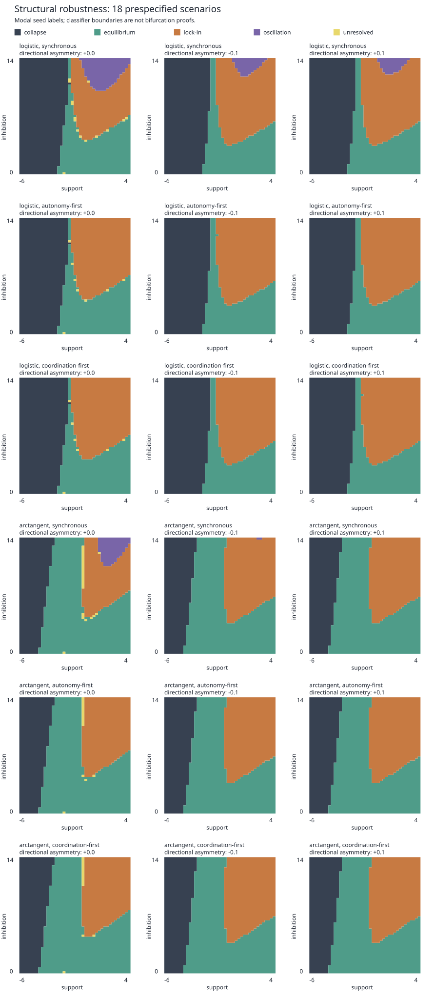

# Antinomy Structural Robustness

## Result

**Narrow CM-04; retain C1 confidence.** Equilibrium, asymmetric lock-in, and
operational collapse meet the prespecified survival criterion in all 18
scenarios. Period-two oscillation meets it in only four: the three synchronous
logistic scenarios and the symmetric synchronous arctangent scenario. No
sequential-update trajectory is classified as oscillatory in the sampled grid.
This is a finite-design result, not proof that sequential systems cannot cycle.

The original baseline is reproduced at every grid coordinate, including all
seven-seed regime counts. None of the 5,166 uncoupled control trajectories
produces lock-in or oscillation. Coupling therefore retains discriminating
value within this experiment, but the four-regime claim is not structurally
robust under the declared test. There is no new empirical evidence for CM-01,
CM-04, or CM-05.

The [prospective protocol](../../research/experiments/antinomy-robustness-protocol.md)
was committed as `0a2fe6d` before executing these sweeps. The
[decision record](../../research/decisions/antinomy-structural-robustness.md)
states the consequence for the wider program. The
[first-cycle model](../antinomy/README.md) and its generated outputs are
preserved as the historical baseline.

## Model and Interventions

Autonomy and coordination are dimensionless capacities in [0, 1]. Each receives
support, self-reinforcement, and a net cross-effect before bounded saturation:

```text
autonomy_next     = f(support + 2 autonomy + (enablement_A - inhibition_A) coordination)
coordination_next = f(support + 2 coordination + (enablement_C - inhibition_C) autonomy)

enablement_A = 2 (1 + d)       inhibition_A = inhibition (1 + d)
enablement_C = 2 (1 - d)       inhibition_C = inhibition (1 - d)
```

The directional parameters are independently represented in code. This
experiment scales both signed mechanisms together with d = 0, -0.1, or +0.1;
only their difference is identified. It does not test separate variations of
support or self-reinforcement, or independently estimate enabling and
inhibiting mechanisms.

The responses are the original logistic and `0.5 + atan(pi input / 4) / pi`.
Both have midpoint 0.5 and midpoint derivative 0.25, but their tails differ.
This controls the local gain, not the response over the entire input range.

Synchronous updates use the previous round's two capacities. An autonomy-first
round updates autonomy, then coordination using the new autonomy and old
coordination; a coordination-first round reverses that order. Every round
updates both capacities once. Sampling occurs at completed round boundaries.
These schedules define different discrete maps, not numerical approximations
of a shared continuous-time model.

The factorial crosses two responses, three schedules, and three asymmetries.
Every scenario uses 2,337 cells: support -6 to 4 and inhibition 0 to 14, both
in increments of 0.25. Each cell has seven seeded initial perturbations around
0.5, 600 rounds, and the original final-100-state classifier. There are 42,066
scenario-cells and 294,462 main trajectories. Shocks remain zero.

A regime survives if at least five cells have that modal label with at least
four seeds agreeing. This screening threshold is neither a significance test
nor a guarantee about attractor basins outside the sampled initial states.
Classification uses the original numerical tolerance, period-two amplitude,
collapse threshold, lock-in gap, and tie order. Unresolved tails stay unresolved.

## Grid Results

Each row totals 2,337 cells. C = operational collapse, E = equilibrium,
L = lock-in, O = period-two oscillation, U = unresolved. “Changed” counts
modal-label changes from the identical-coordinate baseline. “Edge Δ” counts
the symmetric difference between the two sets of adjacent-cell transition
edges; a removed edge and an added edge count separately.

| Response | Schedule | d | C | E | L | O | U | Changed | Edge Δ |
| --- | --- | ---: | ---: | ---: | ---: | ---: | ---: | ---: | ---: |
| Logistic | Synchronous | 0 | 951 | 621 | 544 | 206 | 15 | 0 | 0 |
| Logistic | Synchronous | -0.1 | 918 | 601 | 744 | 74 | 0 | 236 | 276 |
| Logistic | Synchronous | +0.1 | 918 | 601 | 752 | 66 | 0 | 244 | 273 |
| Logistic | Autonomy-first | 0 | 951 | 627 | 751 | 0 | 8 | 213 | 64 |
| Logistic | Autonomy-first | -0.1 | 918 | 602 | 817 | 0 | 0 | 311 | 249 |
| Logistic | Autonomy-first | +0.1 | 918 | 601 | 818 | 0 | 0 | 310 | 245 |
| Logistic | Coordination-first | 0 | 951 | 628 | 751 | 0 | 7 | 214 | 67 |
| Logistic | Coordination-first | -0.1 | 918 | 601 | 818 | 0 | 0 | 310 | 245 |
| Logistic | Coordination-first | +0.1 | 918 | 602 | 817 | 0 | 0 | 311 | 249 |
| Arctangent | Synchronous | 0 | 573 | 1159 | 455 | 120 | 30 | 648 | 355 |
| Arctangent | Synchronous | -0.1 | 554 | 1103 | 678 | 2 | 0 | 713 | 309 |
| Arctangent | Synchronous | +0.1 | 554 | 1103 | 680 | 0 | 0 | 715 | 305 |
| Arctangent | Autonomy-first | 0 | 573 | 1159 | 587 | 0 | 18 | 755 | 338 |
| Arctangent | Autonomy-first | -0.1 | 554 | 1103 | 680 | 0 | 0 | 715 | 305 |
| Arctangent | Autonomy-first | +0.1 | 554 | 1103 | 680 | 0 | 0 | 715 | 305 |
| Arctangent | Coordination-first | 0 | 573 | 1160 | 587 | 0 | 17 | 756 | 342 |
| Arctangent | Coordination-first | -0.1 | 554 | 1103 | 680 | 0 | 0 | 715 | 305 |
| Arctangent | Coordination-first | +0.1 | 554 | 1103 | 680 | 0 | 0 | 715 | 305 |



The asymmetric arctangent conditions fail the oscillation survival criterion,
but do not eliminate every oscillatory trajectory: d = -0.1 has 38 oscillatory
seed runs, and d = +0.1 has 16. Their modal oscillation regions contain only two
and zero cells, respectively. Absence of modal survival must not be reported
as absence of the behavior.

The grid changes by 213–756 modal labels for sequential variants and 236–715
for nonbaseline synchronous variants. The
[summary](outputs/summary.json) also retains matched modal fractions,
per-regime intersection-over-union, edge counts, and edge overlap. These
quantify classifier-map movement; they are not distances between mathematically
continued bifurcations. No new eigenvalue or bifurcation analysis is claimed.

## Seed, Horizon, and Threshold Diagnostics

The baseline has 73 cells with seed disagreement. Symmetric synchronous
arctangent has 71; asymmetric synchronous logistic has 46 and 30, and
asymmetric synchronous arctangent has 14 and 8. Sequential scenarios have
zero or one disagreement cell. Seed counts describe the seven specified
initial perturbations, not estimated basin probabilities.

Changing the sign of d does not give exactly equal modal maps for these seven
seeds. The same numerical seed supplies the same ordered initial pair, not its
variable-swapped counterpart. A separate software test swaps both initial
capacities and update order and verifies exact trajectory equivalence.

The four original reference coordinates were checked at both 600 and 1,200
rounds for every scenario and seed. All 504 primary-classifier comparisons
retain their labels between horizons. This is a reference-point check, not a
double-horizon sweep of the full grid. In particular, it does not resolve all
remaining slow or unclassified grid tails.

The old oscillation reference (support 2, inhibition 12) illustrates why region
survival and example survival must be separated. With synchronous logistic
and d = +0.1, all seven reference runs become lock-in even though 66 grid cells
retain modal oscillation. With d = -0.1, six reference runs become lock-in and
one stays oscillatory. Every sequential reference run becomes lock-in. The
symmetric synchronous arctangent reference remains oscillatory for all seeds.

Nine threshold pairs reclassify each of 1,008 scenario/reference/seed/horizon
tails. Of those tails, 126 change labels: all are the collapse reference under
arctangent responses. The symmetric example settles at approximately 0.09809
in each capacity, below the primary collapse threshold 0.1 but above 0.075.
No reference tail changes label solely because the lock-in gap moves among
0.20, 0.25, and 0.30. Operational collapse remains explicitly threshold-bound;
these reference checks do not establish global threshold robustness.

## Controls and Limits

At every support level, set inhibition equal to enablement separately in each
direction. All 738 scenario/support controls, each with seven seeds, remain
free of lock-in and oscillation. This result holds for the sampled support,
fixed self-reinforcement, and initial-state design. It is not a claim that all
uncoupled nonlinear systems lack those behaviors.

The experiment does not test stochastic schedules, shocks, independent
directional persistence, heterogeneous support, finer grids, delays of varying
length, continuous-time dynamics, adaptive institutions, or alternative initial
state distributions. Common-shock and one-way causal rivals remain open. The
alternative response and asymmetry interventions form one declared family,
not an exhaustive robustness neighborhood. A finite negative sweep cannot
prove mathematical impossibility, and regime recurrence cannot establish
empirical mutual dependence or historical inevitability.

## Reproduction and Artifact Guide

From the repository root:

```bash
just sync
just robustness
just check
```

The full quality gate independently regenerates both model packages and
compares every committed artifact byte for byte. Four worker processes are
used for the structural sweep; output ordering is deterministic. For serial
execution or an alternate output directory:

```bash
uv run --locked python -m models.antinomy_robustness.generate \
  --workers 1 --output-dir /tmp/antinomy-robustness-replication
```

| File | Contents |
| --- | --- |
| [`parameter_sweep.csv`](outputs/parameter_sweep.csv) | All seven seed labels, modal agreement, factors, and coordinates for every scenario-cell |
| [`uncoupled_controls.csv`](outputs/uncoupled_controls.csv) | Separate zero-net-coupling results at all 41 support levels; inhibition column is the nominal cancellation coordinate 2, with directional scaling recorded by d |
| [`transition_edges.csv`](outputs/transition_edges.csv) | Both endpoints of every horizontal or vertical modal-label transition |
| [`witness_checks.csv`](outputs/witness_checks.csv) | 9,072 reference/horizon/threshold records with classifier metrics |
| [`summary.json`](outputs/summary.json) | Settings, protocol SHA-256, baseline verification, survival decision, counts, and overlaps |
| [`regime_maps.svg`](outputs/regime_maps.svg) | Code-native visual comparison of modal regimes |

Witness metrics are serialized to ten decimal places to suppress irrelevant
last-bit platform differences; classification always uses unrounded values.
The small integration test compares serial and parallel outputs byte for byte.
Unit tests protect exact baseline trajectories and classification, explicit
sequential equations, variable exchange, bounds, invalid inputs, full factorial
coverage, survival thresholds, decision precedence, and transition coordinates.
The CLI exits unsuccessfully on baseline mismatch, but a scientific decision
to narrow or reject is a valid result. Small Python-only smoke designs are
marked `full_protocol: false` and cannot return a substantive decision.

## Conclusions and Next Steps

The experiment warrants a narrower formal claim: equilibrium, lock-in, and
operational low-capacity states survive this declared family of perturbations;
period-two oscillation is an additional assumption-sensitive possibility.
The coupled representation still distinguishes outcomes that its uncoupled
control does not, so the present extension is narrowed rather than rejected.
CM-04 remains C1, and CM-01 and CM-05 receive no new empirical support.

The next cycle item should preregister an institutional comparison that
measures directional effects and update timing instead of treating oscillation
as a generic signature of antinomy. It must retain uncoupled and common-shock
rivals and define viability independently of these arbitrary dimensionless
thresholds. That preregistration has not been started in this package.
